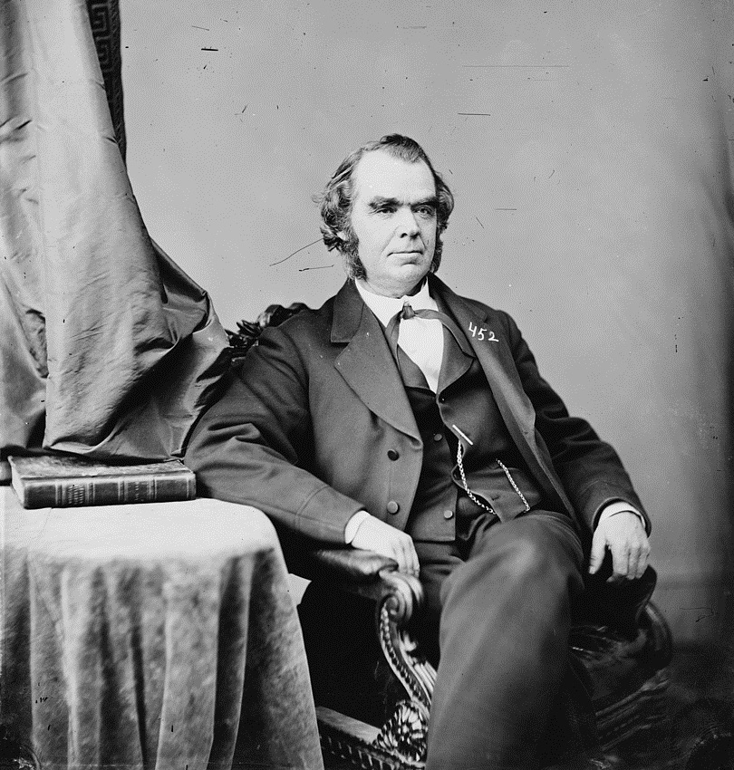

# radial_basis_function

  

Eliakim Hastings Moore (January 26, 1862 – December 30, 1932), was an American mathematician.

Moore, the son of a Methodist minister and grandson of US Congressman Eliakim H. Moore, discovered mathematics through a summer job at the Cincinnati Observatory while in high school. He subsequently studied mathematics at Yale University, where he was a member of Skull and Bones and obtained a BA in 1883 and the PhD in 1885 with a thesis supervised by Hubert Anson Newton, on some work of William Kingdon Clifford and Arthur Cayley.

  

Sir Roger Penrose (born 8 August 1931) is a British mathematician, mathematical physicist, philosopher of science and Nobel Laureate in Physics.

Penrose has contributed to the mathematical physics of general relativity and cosmology. He has received several prizes and awards, including the 1988 Wolf Prize in Physics, which he shared with Stephen Hawking for the Penrose–Hawking singularity theorems, and the 2020 Nobel Prize in Physics "for the discovery that black hole formation is a robust prediction of the general theory of relativity".

$$
[R] \cdot [a] = [A]
$$

---

$$
[a] = \frac{1}{[R]} \cdot [A]
$$

---

$$
\frac{1}{[R]} = ([R^{t}] \cdot [R])^{-1} \cdot [R^{t}]
$$

In mathematics, and in particular linear algebra, the Moore–Penrose inverse is the most widely known generalization of the inverse matrix. It was independently described by E. H. Moore in 1920 and Roger Penrose in 1955.

Understanding the inverse matrix (pseudo-inverse) is fundamental to grasping the Radial Basis Function algorithm.